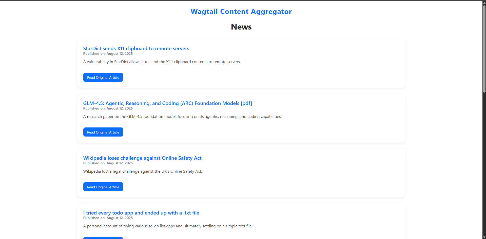
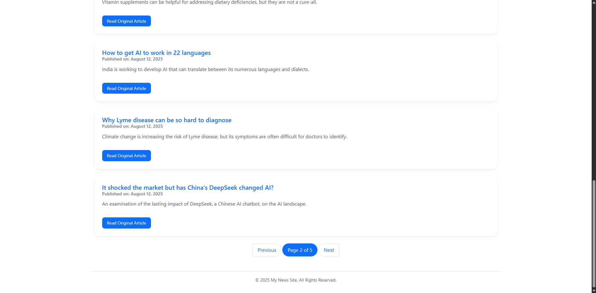

# Wagtail AI-Powered News Scraper

## Project Overview

This is a Django project powered by Wagtail CMS designed to fulfill a specific development test. Its core function is to scrape news articles from various online sources, save them as structured content within the CMS, and display them on a clean, paginated, and styled frontend.

A key feature of this implementation is its resilience and manageability. Instead of using brittle selectors, it leverages the Google Gemini API to intelligently parse HTML, making the scraper robust against minor website layout changes. Furthermore, all scraping targets are managed through the Wagtail admin panel as "Snippets," allowing a non-technical user to add, edit, or disable news sources without requiring any code changes.

## Tech Stack and Tools

*   **Backend:** Python, Django, Wagtail CMS
*   **Web Scraping & Parsing:**
    *   **Google Generative AI (Gemini):** For intelligent data extraction from raw HTML.
    *   **BeautifulSoup4:** For pre-processing HTML and isolating relevant sections before sending to the AI.
    *   **Requests:** For making HTTP requests to fetch website content.
*   **Database:** SQLite (default for local development).
*   **Environment Management:**
    *   `venv` for isolating Python dependencies.
    *   `python-dotenv` for managing environment variables and secrets.
*   **Frontend:** HTML, CSS, Bootstrap 5 (loaded via CDN for simplicity).

---

## Local Setup and Installation

Follow these instructions carefully to get the project running on your local machine.

### 1. Prerequisites
*   Python 3.8+
*   Git

### 2. Clone the Repository
Clone this project to your local machine.
```bash
git clone <your-repository-url>
cd <repository-folder-name>
```

### 3. Create a Virtual Environment
It is crucial to use a virtual environment to manage project-specific dependencies.
```bash
# For Linux/macOS
python3 -m venv venv
source venv/bin/activate

# For Windows
python -m venv venv
venv\Scripts\activate
```

### 4. Create a `requirements.txt` File
If you haven't already, generate a list of all the packages you've installed.
```bash
pip freeze > requirements.txt
```

### 5. Install Dependencies
Install all required packages from the `requirements.txt` file.
```bash
pip install -r requirements.txt
```

### 6. Configure Environment Variables
This project requires secret keys for Django and the Google API. These are managed via a `.env` file for security.

First, create the file in the project's root directory:
```bash
touch .env
```

Next, open the `.env` file and add the following lines, replacing the placeholder values with your actual keys.
```
# .env

# Your API key from Google AI Studio
GOOGLE_API_KEY="your-google-gemini-api-key"

# Set to True for development for detailed error pages
DEBUG="True"
```

### 7. Apply Database Migrations
This will set up the necessary database tables for Wagtail and your custom models.
```bash
python manage.py migrate
```

### 8. Create a Superuser
You need an admin account to log into the Wagtail CMS.
```bash
python manage.py createsuperuser
```
Follow the prompts to create your username and password.

### 9. Run the Development Server
You are now ready to run the project.
```bash
python manage.py runserver
```
The website will be available at `http://127.0.0.1:8000/`.
The Wagtail admin panel is at `http://127.0.0.1:8000/admin/`.

---

## Usage Guide

### 1. Initial Wagtail Page Setup
Before the scraper can save articles, its parent page must exist.
1.  Navigate to the admin panel (`/admin/`) and log in.
2.  In the left-hand menu, go to **Pages -> Home**.
3.  Click "Add child page" and choose **News List Page**.
4.  Give it a title (e.g., "Latest News") and click **"Publish"**.

### 2. Adding a Scraping Source
You can add websites to scrape directly from the admin panel.
1.  In the left-hand menu, click on **Snippets**.
2.  Find **Scraping Sources** and click on it.
3.  Click **"Add Scraping Source"** in the top right.
4.  Fill in the form:
    *   **Name:** A descriptive name (e.g., "BBC Technology").
    *   **URL to Scrape:** The full URL of the page listing articles.
    *   **Base URL:** The domain's base URL, for resolving relative links.
    *   **HTML Selector:** A CSS selector for the main content area that contains all the articles (e.g., `main#main-content`). This helps focus the AI.
    *   **Is active:** Keep this checked to enable scraping for this source.
5.  Click **"Save"**. You can add as many sources as you like.

### 3. Running the Scraper
To fetch and save articles, run the custom management command from your terminal.
```bash
# To scrape all active sources
python manage.py scrape_news

# To scrape only a specific source by its name
python manage.py scrape_news --source "BBC Technology"
```

---

## Django Best Practices and Documentation

This project was built with professional Django and Wagtail conventions in mind.

*   **Settings Management:** Secrets (`SECRET_KEY`, `GOOGLE_API_KEY`) and environment-specific settings (`DEBUG`) are loaded from a `.env` file and are never hardcoded. This is critical for security and deployment flexibility.
*   **Static Files:** Custom CSS is properly namespaced within the `news` app (`news/static/news/css/styles.css`) to prevent conflicts with other Django apps. The templates correctly use the `` tag to resolve paths.
*   **Model Design:** We use a standard Wagtail `Page` model for the articles (`NewsArticlePage`) but leverage a `Snippet` (`ScrapingSource`) for managing the list of scrape targets. This is the correct "Wagtail way," as sources are reusable pieces of data, not pages in the site's hierarchy.
*   **Management Commands:** All operational logic (scraping) is encapsulated in a management command (`scrape_news_gemini`). This makes the script reusable, testable, and easy to schedule with tools like `cron`.
*   **Professional Logging:** The scraper command uses Python's `logging` framework instead of `print()` statements. This is configured in the Django settings to output to both the console and a `logs/scraper.log` file, which is essential for debugging automated tasks.
*   **Security:** The `.gitignore` file is configured to ignore sensitive files like `.env`, `db.sqlite3`, and `__pycache__` directories, ensuring no secrets or environment-specific data is ever committed to version control.

>## Screen Shots
>### Main Page


>### Pagination
